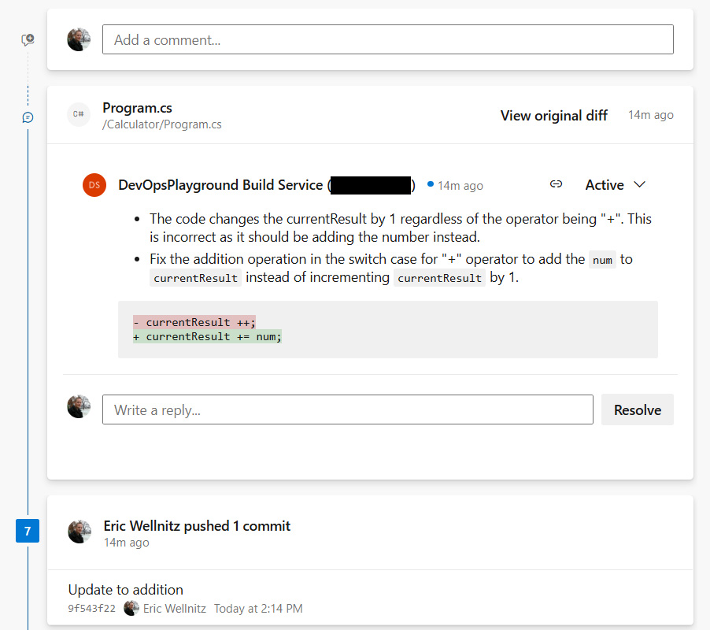

# Pull Request Inspection Assistant (PRIA) - OpenAI PR Review Bot for Azure DevOps

Automate pull request (PR) reviews in Azure DevOps using the PR Inspection Assistant (PRIA) and OpenAI. This bot analyzes code changes, offers suggestions, detects potential bugs, and ensures adherence to coding standards. Streamline code reviews with customizable criteria and natural language feedback, improving code quality and reducing review time.

## Key Features

- **Automated PR Reviews**: Leverage OpenAI to analyze code changes in pull requests.
- **Supports Azure OpenAI**: Isolate your reviews using your own internal model deployments in [Azure AI Foundry](https://learn.microsoft.com/en-us/azure/ai-studio/azure-openai-in-ai-studio).
- **Code Quality Suggestions**: Detect potential issues and ensure best practices are followed.
- **Customizable Review Criteria**: Tailor the bot to specific code quality metrics.
- **Azure DevOps Integration**: Seamlessly integrates with existing DevOps pipelines.
- **Natural Language Feedback**: Provides human-readable, actionable feedback.



## Use Cases

- **Automate Routine PR Tasks**: Speed up the code review process by automating common review tasks.
- **Improve Code Quality**: Receive consistent, detailed feedback to enhance code quality.
- **Early Bug Detection**: Help developers understand best practices and identify bugs early in the development cycle.

## Process


## Prerequisites

- An [OpenAI API Key](https://platform.openai.com/docs/overview)
- Build Administrators must be given "Contribute to pull requests" access. Check [this Stack Overflow answer](https://stackoverflow.com/a/57985733) for guidance on setting up permissions.

### If Using Azure OpenAI

- A generated API key for you OpenAI service
- Your service endpoint URL e.g., `https://my-resource.azure.openai.com/`
- A [deployed model](https://learn.microsoft.com/en-us/azure/ai-studio/how-to/deploy-models-openai)
  - By default the task will try to use a deployment called `'o3-mini'`
  - Valid options are:
    - 'o3-mini'
    - 'o1-mini'
    - 'o1-preview'
    - 'gpt-4o'
    - 'gpt-4'
    - 'gpt-3.5-turbo'
- A designated [API version](https://learn.microsoft.com/en-us/azure/ai-services/openai/api-version-deprecation). Defaults to `'2024-10-21'`

[Learn more about Azure AI Foundry](https://learn.microsoft.com/en-us/azure/ai-studio/azure-openai-in-ai-studio)

## Getting Started

### 1. Install the PRIA DevOps Extension

   Install the [PRIA](https://marketplace.visualstudio.com/items?itemName=EricWellnitz.pria) DevOps extension from the Azure DevOps Marketplace.

### 2. Create a PRIA Code Review Pipeline

   Create an [Azure DevOps Pipeline](https://learn.microsoft.com/en-us/azure/devops/pipelines/create-first-pipeline) using the following YAML snippet to set up the PRIA code review task:

#### OpenAI API

```yaml
trigger: none

jobs:
  - job: CodeReview
    pool:
      vmImage: 'ubuntu-latest'
    steps:
      - checkout: self
        persistCredentials: true
      - task: PRIA@2
        inputs:
          api_key: '$(OpenAI_ApiKey)'
```

#### Azure OpenAI

```yaml
trigger: none

jobs:
  - job: CodeReview
    pool:
      vmImage: 'ubuntu-latest'
    steps:
      - checkout: self
        persistCredentials: true
      - task: PRIA@2
        inputs:
          api_key: '$(OpenAI_ApiKey)'
          api_version: '2024-10-21'
          api_endpoint: 'https://my-foundry-project.openai.azure.com/'
          ai_model: 'gpt-4o'
```
### 3. Optional Task Inputs

Additional input options can be set to tailor how the code is reviewed.

| Input | Type | Default | Description |
|---|---|---|---|
| `bugs` | Boolean | `false` | Specify whether to enable bug checking during the code review process. |
| `performance` | Boolean | `false` | Specify whether to include performance checks during the code review process. |
| `best_practices` | Boolean | `false` | Specify whether to include checks for missed best practices during the code review process. |
| `modified_lines_only` | Boolean | `true` | Specify whether to check modified lines only. |
| `file_extensions` | String | `null` | Specify a comma-separated list of file extensions for which you want to perform a code review. |
| `file_excludes` | String | `null` | Specify a comma-separated list of file names that should be excluded from code reviews. |
| `additional_prompts` | String | `null` | Specify additional OpenAI prompts as a comma-separated list to enhance the code review. |

### 4. Configure your Main Branch for Build Validation

  Note that `pr` triggers do not work in Azure repos.
  
  Cofigure Azure DevOps [branch policies](https://learn.microsoft.com/en-us/azure/devops/repos/git/branch-policies?view=azure-devops&tabs=browser#build-validation) to use the PRIA Code Review Pipeline created above as a build validation pipeline.


## Build & Publish

1. Install [Prequisites](https://learn.microsoft.com/en-us/azure/devops/extend/develop/add-build-task?toc=%2Fazure%2Fdevops%2Fmarketplace-extensibility%2Ftoc.json&view=azure-devops#prerequisites)
1. Install dependencies and build extension
```bash
# Navigate to src and install
$ cd pr-inspection-assistant/src
$ npm install

# Build typescript and package .vsix file
$ npm run package
```

## Local Development Testing
This is a work in progress.  

1. Copy `.env.local.example` to `.env.local` and fill in the values
2. On your target git repo for review (specified by `System_DefaultWorkingDirectory` in `.env.local`), set your current branch to the desired pull request in Azure Devops.
```bash
# Fetch the refspec for the pull requests
git fetch --force --tags --prune --prune-tags --progress --no-recurse-submodules origin +refs/heads/*:refs/remotes/origin/* +refs/pull/<your_pr_id>/merge:refs/remotes/pull/<your_pr_id>/merge

# Set current branch to PR branch
git checkout pull/<your_pr_id>/merge
```
3. Compare file diffs to make sure it's the same as what is reported in Azure Devops for the PR
```bash
git diff --name-only origin/master
```

If the files are different, you may need to run the Azure Devops Pipeline for the Pull Request so that its PR branch is up-to-date w/ latest master/main branch.  Then re-run step 2 and 3.

4. After determining file diff matches Azure Devops PR, in `.env.local`, set `TargetBranch_IncludeOriginPrefix` to false.  This is so that the file diffs won't change on us (because our target branch will be our local master) while we're testing, which could be caused by new pushes to origin/master.

5. Run the task locally
```bash
npm run dev
```

### Resources
- [Marketplace Pipeline Extension](https://learn.microsoft.com/en-us/azure/devops/extend/develop/add-build-task?toc=%2Fazure%2Fdevops%2Fmarketplace-extensibility%2Ftoc.json&view=azure-devops)
- [Publisher Portal](https://marketplace.visualstudio.com/manage/publishers)
